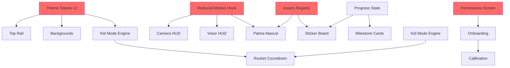

# UI 2.0 vs Current State — Side-by-Side Comparison

> Visual comparison table showing what exists vs what UI 2.0 requires

---

## Component Inventory

| Component                  | Current State                       | UI 2.0 Requirement                                                      | Status      |
| -------------------------- | ----------------------------------- | ----------------------------------------------------------------------- | ----------- |
| **AppShell**               | ✅ Exists                           | ✅ Extend for theme switching                                           | 🟡 Update   |
| **TopRail**                | ❌ None                             | ✅ Learn \| Practice · Kid · Voice · Settings                           | 🔴 Create   |
| **BottomActions**          | ❌ None                             | ✅ Replay · Slow · Next · Help (mobile)                                 | 🔴 Create   |
| **PermissionsScreen**      | ❌ None (camera only in CameraFeed) | ✅ Unified camera+mic gate + demo fallback                              | 🔴 Create   |
| **StatusChip** (HUD)       | ❌ None                             | ✅ Scanning \| Hand found \| Hold steady \| Nice!                       | 🔴 Create   |
| **HandProgressRing** (HUD) | ❌ None                             | ✅ Ring around detected hand during holds                               | 🔴 Create   |
| **ConfidenceBar** (HUD)    | ❌ None                             | ✅ Thumbs Up 92% with bar                                               | 🔴 Create   |
| **TipsRail** (HUD)         | ❌ None                             | ✅ 1-line contextual tip                                                | 🔴 Create   |
| **MicOrb**                 | ❌ None (basic badge)               | ✅ Idle → listening pulse → command glow                                | 🔴 Create   |
| **TranscriptBubble**       | ❌ None                             | ✅ Live transcript with aria-live                                       | 🔴 Create   |
| **CountdownOverlay**       | ✅ Exists                           | ✅ Split into Rocket (kid) + Finger (adult)                             | 🟡 Refactor |
| **OnboardingCarousel**     | ❌ None (DirectionsSheet exists)    | ✅ 3 slides: camera/mic, gestures, choose mode                          | 🔴 Create   |
| **CalibrationFlow**        | ❌ None                             | ✅ 4 gestures with live meters + save thresholds                        | 🔴 Create   |
| **StickerBoard**           | ❌ None                             | ✅ Placeable stickers with layout persistence                           | 🔴 Create   |
| **MilestoneCard**          | ❌ None                             | ✅ 5/10 signs + path complete + Golden Spark                            | 🔴 Create   |
| **Palma** (mascot)         | ❌ None                             | ✅ 6-state animation (idle/listening/thinking/encouraging/success/oops) | 🔴 Create   |
| **PalmaManager**           | ❌ None                             | ✅ Event bus → state orchestrator                                       | 🔴 Create   |
| **PathCard**               | ❌ None (LevelCard exists)          | ✅ Cards for Learn paths with star goals                                | 🔴 Create   |
| **NoHandFoundScreen**      | ❌ None                             | ✅ Try again + 3 quick tips                                             | 🔴 Create   |
| **LowLightToggle**         | ❌ None                             | ✅ High gain mode + tip                                                 | 🔴 Create   |
| **VoicePermissionBanner**  | ❌ None                             | ✅ Mic denied + how to fix                                              | 🔴 Create   |

**Summary:** 3 components exist, 17 need creation, 2 need updates

---

## State Management

| Store/State        | Current                              | UI 2.0 Requirement                            | Status    |
| ------------------ | ------------------------------------ | --------------------------------------------- | --------- |
| **useLessonStore** | ✅ kidMode, level, stars, clip queue | ✅ Add streak, milestones                     | 🟡 Extend |
| **kidMode.ts**     | ❌ None (boolean in store)           | ✅ Theme + behavior config                    | 🔴 Create |
| **progress.ts**    | ❌ None                              | ✅ Sticker layout, milestone triggers, streak | 🔴 Create |
| **voice.ts**       | ❌ None (hook only)                  | ✅ Transcript state, hint tracking            | 🔴 Create |

---

## Hooks

| Hook                 | Current   | UI 2.0 Requirement                    | Status    |
| -------------------- | --------- | ------------------------------------- | --------- |
| **useVoiceInput**    | ✅ Exists | ✅ Add transcript bubble integration  | 🟡 Extend |
| **useGestureInput**  | ✅ Exists | ✅ Add kid mode pacing (FPS throttle) | 🟡 Extend |
| **useReducedMotion** | ❌ None   | ✅ Global hook + CSS class system     | 🔴 Create |

---

## Styles & Assets

| Asset Type          | Current                        | UI 2.0 Requirement                                     | Status    |
| ------------------- | ------------------------------ | ------------------------------------------------------ | --------- |
| **Palettes**        | ✅ Single palette              | ✅ Adult A2 + Kid K2 with CSS vars                     | 🔴 Add    |
| **Motion Tokens**   | ✅ Basic                       | ✅ Micro 200-300ms, Scene 600-900ms, 30fps cap         | 🔴 Add    |
| **backgrounds.css** | ❌ None (inline in AppShell)   | ✅ Adult (gradient+grain) + Kid (pattern+parallax)     | 🔴 Create |
| **Lottie: Rocket**  | ❌ None                        | ✅ Kid countdown animation                             | 🔴 Create |
| **Lottie: Finger**  | ❌ None                        | ✅ Adult countdown animation                           | 🔴 Create |
| **Lottie: Palma**   | ❌ None                        | ✅ 6 state files x 2 variants (adult/kid) = 12 files   | 🔴 Create |
| **Stickers**        | ❌ None (UnlockSticker exists) | ✅ 12-16 SVG/Lottie stickers with rarity               | 🔴 Create |
| **registry.json**   | ❌ None                        | ✅ Asset manifest (id/title/alt/variant/unlock/rarity) | 🔴 Create |
| **ATTRIBUTION.md**  | ❌ None                        | ✅ License credits for external assets                 | 🔴 Create |

---

## Flows & Screens

| Flow              | Current                       | UI 2.0 Requirement                                      | Status               |
| ----------------- | ----------------------------- | ------------------------------------------------------- | -------------------- |
| **Entry**         | Welcome → Directions → Lesson | Permissions → Onboarding → Calibration → Learn/Practice | 🔴 Add 3 new screens |
| **Learn Mode**    | ❌ None                       | Paths grid (Basics, Everyday, Feelings) with star goals | 🔴 Create            |
| **Practice Mode** | ✅ PracticePage exists        | ✅ Keep + integrate HUDs                                | 🟢 Keep              |
| **Recovery**      | ✅ Basic camera error         | ✅ 4 patterns (no camera, no hand, low light, voice)    | 🟡 Extend            |

---

## Accessibility Features

| Feature            | Current                               | UI 2.0 Requirement                     | Status    |
| ------------------ | ------------------------------------- | -------------------------------------- | --------- |
| **Focus-visible**  | ✅ Basic                              | ✅ All controls ≥44px                  | 🟡 Audit  |
| **ARIA-live**      | ❌ None                               | ✅ HUD states, transcripts, milestones | 🔴 Add    |
| **Reduced-motion** | ✅ Basic (prefers-reduced-motion CSS) | ✅ Global hook, Lottie→static fallback | 🟡 Extend |
| **VTT Captions**   | ❌ None                               | ✅ Lesson videos with caption tracks   | 🔴 Add    |
| **Screen Reader**  | ✅ Basic                              | ✅ VoiceOver/NVDA happy path passes    | 🟡 Test   |

---

## Analytics Events

| Event Category  | Current          | UI 2.0 Requirement                                        | Status    |
| --------------- | ---------------- | --------------------------------------------------------- | --------- |
| **Permissions** | ❌ None          | ✅ `perm:prompted\|granted\|denied`                       | 🔴 Add    |
| **Countdown**   | ❌ None          | ✅ `countdown:shown\|completed\|skipped {mode}`           | 🔴 Add    |
| **HUD**         | ❌ None          | ✅ `hud:state {scanning\|found\|hold\|success}`           | 🔴 Add    |
| **Voice**       | ✅ Basic logs    | ✅ `voice:heard {text}` (hashed), `voice:hint_shown`      | 🟡 Extend |
| **Calibration** | ❌ None          | ✅ `calibration:done`                                     | 🔴 Add    |
| **Kid Mode**    | ❌ None          | ✅ `kid:enabled`                                          | 🔴 Add    |
| **Progress**    | ✅ Basic (stars) | ✅ `progress:sticker_awarded`, `milestone:reached {type}` | 🟡 Extend |
| **Mascot**      | ❌ None          | ✅ `mascot:state_enter {state}`, `mascot:nudge_shown`     | 🔴 Add    |

---

## Technical Debt Identified

| Issue                               | Current State     | Impact                              | Priority  |
| ----------------------------------- | ----------------- | ----------------------------------- | --------- |
| **Single theme system**             | One palette       | Blocks adult/kid visual distinction | 🔴 High   |
| **No HUD framework**                | None              | Blocks camera/voice status clarity  | 🔴 High   |
| **CountdownOverlay not mode-aware** | Generic countdown | No kid rocket or adult finger       | 🟡 Medium |
| **No calibration**                  | Fixed thresholds  | Poor accuracy across devices        | 🟡 Medium |
| **No gamification state**           | Stars only        | No stickers, milestones, streaks    | 🟡 Medium |
| **Limited recovery UI**             | Basic errors      | Poor UX on permission denied        | 🟢 Low    |
| **No VTT support**                  | None              | Accessibility gap                   | 🟢 Low    |

---

## Effort Estimation

### By Component Size

| Size              | Count | Examples                                                                                 |
| ----------------- | ----- | ---------------------------------------------------------------------------------------- |
| **Large (3-6h)**  | 6     | Camera HUD (full), Calibration, Kid Mode engine, Sticker board, Palma system, Onboarding |
| **Medium (1-3h)** | 12    | Top rail, Bottom actions, Voice HUD, Milestone cards, PathCard, PermissionsScreen, etc.  |
| **Small (≤1h)**   | 15    | Reduced-motion hook, Registry, ATTRIBUTION.md, Recovery screens, Backgrounds, etc.       |

**Total Estimated Effort:** ~75 hours (roughly 2 weeks for 1 developer)

---

## Risk Assessment

| Risk                                          | Likelihood | Impact | Mitigation                                            |
| --------------------------------------------- | ---------- | ------ | ----------------------------------------------------- |
| **Asset creation delays**                     | High       | High   | Start with SVG placeholders, swap Lottie later        |
| **Theme switching breaks existing UI**        | Medium     | High   | Feature flag + incremental rollout                    |
| **Performance on mobile (Lottie + parallax)** | Medium     | Medium | 30fps cap, pause when hidden, reduced-motion fallback |
| **Calibration UX confusing**                  | Medium     | Medium | User testing + clear copy + skip option               |
| **Streak logic edge cases**                   | Low        | Low    | Grace day + clear messaging                           |

---

## Compatibility Matrix

| Feature           | Desktop | Mobile              | Tablet | Notes                      |
| ----------------- | ------- | ------------------- | ------ | -------------------------- |
| **Split View**    | ✅      | ❌ (bottom actions) | ✅     | Responsive breakpoints     |
| **Parallax**      | ✅      | ⚠️ (perf)           | ✅     | Disabled on reduced-motion |
| **Camera HUD**    | ✅      | ✅                  | ✅     | Scales with viewport       |
| **Voice Orb**     | ✅      | ✅                  | ✅     | Touch-friendly             |
| **Calibration**   | ✅      | ✅                  | ✅     | Requires camera            |
| **Sticker Board** | ✅      | ✅ (drag)           | ✅     | Touch + mouse              |

---

## Quick Wins (Easy Wins to Start)

1. ✅ **ATTRIBUTION.md** — Document licenses (30 min)
2. ✅ **registry.json stub** — Empty manifest (15 min)
3. ✅ **useReducedMotion hook** — Global hook (1h)
4. ✅ **Voice permission banner** — Simple error state (1h)
5. ✅ **Adult/Kid color tokens** — CSS vars (2h)

---

## Blockers (Cannot Proceed Until Resolved)

1. 🚫 **Lottie asset creation** — Need Rocket, Finger, Palma states (design team)
2. 🚫 **Kid palette finalization** — Confirm hex values (stakeholder)
3. 🚫 **Sticker design** — Count + rarity tiers (design team)

---

## Dependencies (Task Order)



**Critical Path:** Theme Tokens → Kid Mode Engine → Rocket Countdown

---

## Feature Flag Strategy

```env
# Phase A: Foundation
VITE_UI2_ENABLED=0

# Phase B: Entry + Layout (internal testing)
VITE_UI2_ENABLED=1
VITE_UI2_THEMES=1
VITE_UI2_TOP_RAIL=1

# Phase C: HUDs (beta users)
VITE_UI2_CAMERA_HUD=1
VITE_UI2_VOICE_HUD=1
VITE_UI2_PALMA=1

# Phase D: Modes (full QA)
VITE_UI2_ONBOARDING=1
VITE_UI2_CALIBRATION=1
VITE_KID_MODE_V2=1

# Phase E: Gamification
VITE_UI2_STICKERS=1
VITE_UI2_MILESTONES=1
VITE_UI2_STREAKS=1

# Phase F: Full rollout
VITE_UI2_ENABLED=1 (all sub-flags implied)
```

---

## Testing Checklist

- [ ] Adult theme renders correctly
- [ ] Kid theme renders correctly
- [ ] Theme switches without page reload
- [ ] Reduced-motion disables animations
- [ ] Camera HUD updates on gesture detection
- [ ] Voice HUD shows live transcript
- [ ] Palma responds to voice/gesture events
- [ ] Rocket countdown shows in Kid mode
- [ ] Finger countdown shows in Adult mode
- [ ] Onboarding skippable
- [ ] Calibration saves thresholds
- [ ] Stickers placeable and persist
- [ ] Milestones trigger on events
- [ ] Streak increments daily
- [ ] Grace day logic works
- [ ] No camera → demo video works
- [ ] No hand found → recovery screen works
- [ ] Low light → toggle appears
- [ ] Voice denied → banner shows
- [ ] ARIA-live announces HUD changes
- [ ] Keyboard navigates all controls
- [ ] VTT captions display
- [ ] VoiceOver announces correctly
- [ ] No regression in lesson flow
- [ ] No regression in practice flow

---

**Status Legend:**

- ✅ Exists / Ready
- 🟢 Keep as is
- 🟡 Update / Extend
- 🔴 Create new
- ❌ None / Missing
- ⚠️ Performance concern
